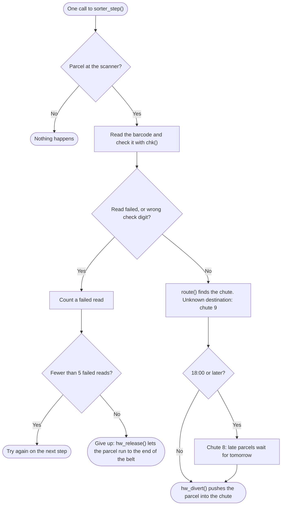

# GitHub Copilot lab

This repository has a guided tour of the GitHub Copilot building blocks and two hands-on challenges. You set up once, then work through each challenge in pairs, in 45–60 minutes.

| Section | What you find there |
| ------- | ------------------- |
| [Get started](#get-started) | Clone the repository and open it in your editor |
| [Set up the C build](#set-up-the-c-build-challenge-1) | Build and test the C code for Challenge 1 |
| [Challenge 1: specs you can test](#challenge-1-specs-you-can-test) | Describe legacy C code in specs, then turn every scenario into a test |
| [Challenge 2: better implementation tickets](#challenge-2-better-implementation-tickets) | Turn a vague business request into a ticket a developer can start on |
| [Customisation tour](#customisation-tour-presenter-script) | The script the presenter follows in the demo |

## Get started

```
git clone https://github.com/alessandro-avila/github-copilot-lab.git
cd github-copilot-lab
```

Open the repository root in VS Code or Visual Studio 2026, not a subfolder, so Copilot finds `.github/`. In Copilot Chat, pick **Agent** mode. You run a prompt file by typing `/` and its name, for example `/spec-from-code`; in Visual Studio versions before 2026, type `#prompt:` and pick it.

In Visual Studio, switch on custom instructions: in **Tools > Options > All Settings > GitHub > Copilot > Copilot Chat**, select **Enable custom instructions to be loaded from .github/copilot-instructions.md files and added to requests**.

## Set up the C build (Challenge 1)

Challenge 1 builds the C code in `legacy-c/` with CMake and runs its tests with CTest. You set it up once, in the editor you use.

### VS Code

Install the C/C++ and CMake Tools extensions. `.vscode/settings.json` already points CMake Tools at `legacy-c/`. Pick a compiler kit when CMake Tools asks, then run **CMake: Build** and **CMake: Run Tests**.

### Visual Studio 2026

You need the **Desktop development with C++** workload.

1. Choose **File > Open > Folder** and pick the repository root.
2. When Visual Studio asks whether to enable CMake, choose yes. In the file it opens, `.vs/CMakeWorkspaceSettings.json`, set:

   ```json
   {
     "enableCMake": true,
     "sourceDirectory": "legacy-c"
   }
   ```

   If you said no earlier, the file contains `"enableCMake": false`. Open it with **Project > CMake Workspace Settings** and change it as above.
3. Save the file, choose **Build > Build All**, and run the tests from **Test Explorer**.

Git ignores `.vs/`, so everyone does this once on their own machine.

### Command line

From the repository root:

```
cmake -S legacy-c -B build
cmake --build build
ctest --test-dir build -C Debug
```

If your shell cannot find `cmake`, use a Developer Command Prompt or Developer PowerShell for Visual Studio.

## Challenge 1: specs you can test

You describe what a small, deliberately rough C program does today in Given/When/Then specs, then turn every scenario into a test.

### The parcel sorter

A parcel is a package with a barcode label. A conveyor belt carries it past a scanner, which reads the barcode: the first two digits are the parcel's destination. A diverter then pushes the parcel off the belt into a chute, the exit for that destination. If the scanner cannot read the label, the parcel runs on to the end of the belt.

Example: `30123458` → destination `30` → chute 3. The last digit, `8`, is a check digit.

The code lives in [legacy-c/](legacy-c/README.md):

| File | What it does | Difficulty |
| ---- | ------------ | ---------- |
| `checksum.c` | Tests the check digit, which catches most misreads | Easy: one function |
| `route.c` | Finds the chute for a destination in a table. Unknown destinations go to chute 9 | Medium: a global table |
| `sorter.c` | One machine step: read the barcode, find the chute, push the parcel into it | Hard: hardware and the time of day |
| `hw.c` | Stand-in for the hardware, so the program runs on a laptop | — |
| `tests/fake_hw.c` | Provided test support: fake hardware for the sorter tests. You do not change it | — |

### One sorter step

`main.c` calls `sorter_step()` again and again. This is what one call does:



`route()` starts with this table, and `route_add()` can add destinations while the program runs:

| Destination | Chute |
| ----------- | ----- |
| `10`, `11` | 1 |
| `20` | 2 |
| `30`, `31` | 3 |
| `40` | 4 |
| Any other | 9 |

### How you work

| Step | You run | What happens |
| ---- | ------- | ------------ |
| 1. Spec | `/spec-from-code` | Copilot describes what the code does today as numbered Given/When/Then scenarios, and flags anything odd |
| 2. Review | The **Spec reviewer** agent, optional | You check the spec against the code and the [spec rules](legacy-c/specs/README.md), and decide on every flag. The agent points out problems and never edits |
| 3. Tests | `/tests-from-spec` | Copilot writes one test per scenario, then builds and runs them. They pass on the unchanged code |

You work through three levels, from easy to hard:

| Level | Time | What you do |
| ----- | ---- | ----------- |
| 1: `checksum` | 10 minutes | Read the worked spec and its tests. Every scenario has one test |
| 2: `route` | 15 minutes | Turn a reviewed spec into tests with `/tests-from-spec` |
| 3: `sorter` | 30 minutes | Write the spec with `/spec-from-code`, review it, then test it with the provided fake hardware |
| Stretch | If you have time | Change the behaviour, spec first, with the ticket from Challenge 2 |

Full steps, hints and the reference solution: [Challenge 1](challenges/01-legacy-c-testable/README.md).

## Challenge 2: better implementation tickets

You turn a vague business request into a ticket a developer can start on: Copilot drafts, and a person decides.

You start from a [poor ticket](challenges/02-better-tickets/examples/poor-ticket.md) and three uneven [business requests](challenges/02-better-tickets/business-requests/): an e-mail from operations, rough meeting notes and a one-line request. The e-mail is about the sorter from Challenge 1, so its ticket leads to the Challenge 1 stretch step.

| Step | Who | What happens |
| ---- | --- | ------------ |
| 1. Draft | Copilot, with `/refine-ticket` | Reads the request, finds the code it touches and drafts the ticket. Where information is missing, it first asks up to three questions |
| 2. Answer | The product owner | Answers the questions. Anything nobody knows becomes an open question: Copilot does not invent numbers |
| 3. Check | You | Check the ticket against "Ready when" in the [ticket template](challenges/02-better-tickets/ticket-template.md) |

Jira is optional: see the [challenge README](challenges/02-better-tickets/README.md#connect-copilot-to-jira-optional) for the MCP server and the security approval it needs.

Full steps: [Challenge 2](challenges/02-better-tickets/README.md).

## Customisation tour (presenter script)

Five customization primitives.

| # | Primitive | Lives in | Invoked |
| - | --------- | -------- | ------- |
| 1 | Repo instructions | `.github/copilot-instructions.md` | always |
| 2 | Path instructions | `.github/instructions/*.instructions.md` | by `applyTo` glob |
| 3 | Prompt files | `.github/prompts/*.prompt.md` | `/name` |
| 4 | Skills | `.github/skills/*/SKILL.md` | by the model |
| 5 | MCP servers | `.vscode/mcp.json`, `.mcp.json` | tool calls |
| 6 | Plugins | installed, not committed | bundles 4 + 5 |

### Pre-flight

- Open this folder as the workspace root
- Chat view → **Agent** mode
- **MCP: List Servers** → `microsoft-learn` running (no auth needed)
- `docs/adr/` empty except `.gitkeep`

---

### 1. Repo instructions — always on

Show `.github/copilot-instructions.md`, then:

```
What does the cancel function in app/api.ts do, and is there anything wrong with it?
```

**Look for:** the `— Copilot Lab 🧪` footer. Nobody asked for it. Also British
spelling and full words over abbreviations.

### 2. Path instructions

The two files deliberately contradict each other. That contrast is the demo.

With **`app/api.ts`** open:

```
Add a function that finds all orders with a given status.
```

**Look for:** explicit types, no `any`, `T | null` instead of throwing, TSDoc.

Now open **`app/README.md`**:

```
Add a short section describing what this module is for.
```

**Look for:** sentence-case heading, "you" not "we", no marketing adjectives, a
`## Related` section. Same session, different rules.

### 3. Prompt files

```
/new-endpoint refunds
```

**Look for:** the argument hint in the input, and the TypeScript rules from beat 2
still applying underneath. Layers compose.

Self-documenting recap:

```
/explain-customizations
```

### 4. Skills

`.github/skills/adr-writer/` is a *folder*: `SKILL.md` + `template.md` +
`scripts/new-adr.ps1`. The `description` line is what triggers it.

No slash command, no mention of ADRs:

```
We've decided to use Postgres instead of MongoDB for the orders service, mainly because we need real transactions. Capture that decision.
```

**Look for:** it loads the skill unprompted, asks for alternatives and
consequences, writes `docs/adr/0001-*.md` from the bundled template.

Skills can ship executables — instructions can't:

```powershell
pwsh .github/skills/adr-writer/scripts/new-adr.ps1 -Title "Adopt OpenTelemetry"
```

**Fallback:** `/skills` to enable explicitly, or "use the adr-writer skill".
**Reset:** `Remove-Item docs\adr\*.md`

### 5. MCP servers — reach outside the repo

```
Using the Microsoft Learn MCP server, find the current guidance on Azure Container Apps scaling rules and summarise the options in a table.
```

**Look for:** tool-call disclosures. Expand one. Then **Configure Tools**.

**Two files, not interchangeable:**

| | `.vscode/mcp.json` | `.mcp.json` |
| - | ------------------ | ----------- |
| Read by | VS Code | CLI, Agent Host, Copilot app |
| Key | `"servers"` | `"mcpServers"` |
| Format | JSONC | strict JSON |
| `${input:}` | yes | no |

**The punchline:** VS Code forwards `.vscode/mcp.json` to the Agent Host *except*
`${input:}` servers — it can't show the prompt. So they work in VS Code and vanish
in the CLI. That is why both files exist.

**Expect:** *"where did all those other servers come from?"* Five sources merge with
no de-duplication — extensions, user profile, plugins, `~/.copilot/mcp-config.json`,
workspace. See the [cheatsheet](docs/CHEATSHEET.md).

**Fallback:** `List the open issues in the microsoft/vscode repository.`

### 6. Plugins — packaging

`plugins/copilot-lab-plugin/` is there to **read**, not load. Repo plugin folders
are never auto-discovered; real installs land in `~/.copilot/installed-plugins/`.

Portable: `skills/`, `mcp.json`. Copilot-only: `com.github.copilot/agents/`.

**Live install:** Extensions view → `@agentPlugins` → install from
`awesome-copilot` → show its skills in `/skills`.

```bash
copilot plugin install PLUGIN-NAME@awesome-copilot
```

Then ask for what the bundled skill does:

```
Draft release notes for the changes in this repository since the last tag.
```

### Bonus — custom agents

`.github/agents/docs-reviewer.agent.md`. Pick **Docs reviewer** from the agent
dropdown, then:

```
Review docs/CHEATSHEET.md against our house style.
```

**Look for:** it reviews and refuses to rewrite. Constrained tools enforce the role.

Frontmatter worth showing: `tools` limits capability. Adding `agent` enables
**subagent delegation** — but subagents bring their own tools, so a read-only
reviewer could delegate to something that edits. Whitelist with `agents:` or leave
`agent` out.

---

### Closing

**"Which do I use?"** Work down the table at the top. Stop at the first row that
fits. Most teams need row 1 only.

| | VS Code | CLI | Copilot app |
| - | ------- | --- | ----------- |
| `copilot-instructions.md` | yes | yes | yes |
| `*.instructions.md` | yes | yes | yes |
| Prompt files | local agents only | — | — |
| Skills | yes | yes | yes |
| MCP | both files | `.mcp.json` | `.mcp.json` |
| Plugins | yes | yes | yes |

Skills and MCP are the portable core. Invest there first.

## Related

- [Cheatsheet](docs/CHEATSHEET.md) — locations, precedence, MCP sources, chat modes
- [Demo app](app/README.md)
- [Plugin anatomy](plugins/copilot-lab-plugin/README.md)
- [Challenges](challenges/README.md) — both challenges, and how to run them
- [Challenge 1: specs you can test](challenges/01-legacy-c-testable/README.md)
- [Challenge 2: better implementation tickets](challenges/02-better-tickets/README.md)
